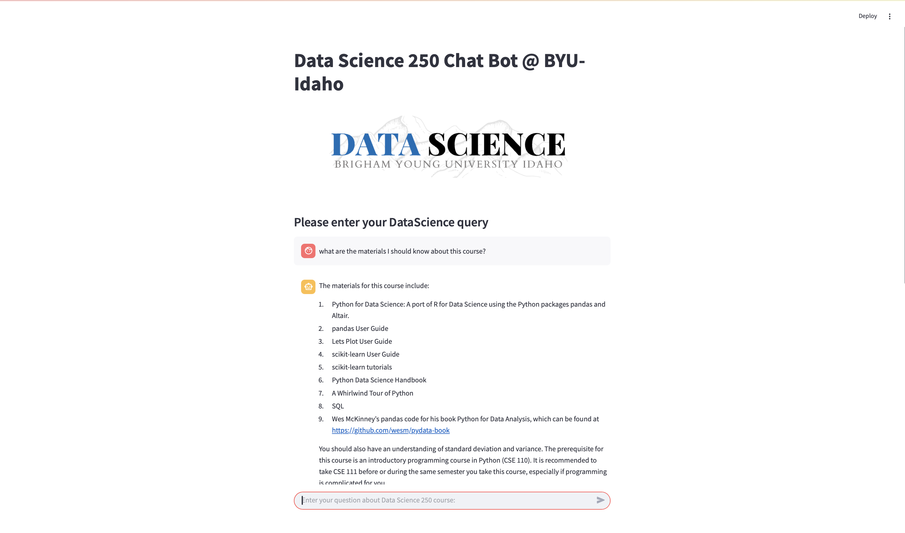

# 🤖 DS250 Chat Bot @ BYU–Idaho

Welcome to the **Data Science 250 Chat Bot**, a smart assistant trained on the BYU–Idaho DS250 course website.

This chatbot uses:
- **LangChain** for RAG (Retrieval-Augmented Generation)
- **OpenAI GPT-4** to generate responses
- **FAISS** to store and search chunks of the course site
- **Streamlit** for the chat interface

---


---

## 🧠 Demo



---

## 📁 Project Structure

| File | Description |
|------|-------------|
| `ds250-FAISS-upload.py` | Script to process HTML files, chunk, embed, and build a FAISS vector index |
| `ds250-query.py` | Streamlit chatbot interface that responds to user questions |
| `.env.example` | Template for setting your OpenAI API key |
| `requirements.txt` | All Python dependencies |
| `ds_250_Logo.png` | Header/logo image used in the chatbot |
| `example_demo.png` | Screenshot of chatbot in action |

---

## 🛠️ Setup Instructions

### 1. Clone the Repo

```bash
git clone https://github.com/your-username/ds250-chatbot.git
cd ds250-chatbot
```

---

### 2. Create a Python Environment

```bash
python -m venv venv
source venv/bin/activate      # Windows: venv\Scripts\activate
pip install -r requirements.txt
```

---

### 3. Add Your OpenAI API Key

Create a file named `.env` (you can copy the template):

```bash
cp .env.example .env
```

Paste your key into the file:

```env
OPENAI_API_KEY=sk-xxxxxxxxxxxxxxxxxxxxxxxxxxxxxxxxxxxx
```

---

### 4. Download the Course Website

Run this command to download the DS250 GitHub site into `lanchain-docs/`:

```bash
wget -r -A.html -P lanchain-docs https://byuistats.github.io/DS250-Course/
```

It will create files under:
```
lanchain-docs/byuistats.github.io/DS250-Course/
```

---

### 5. Build the FAISS Vector Database

Run the script to create `ds250_faiss_index/`:

```bash
python ds250-FAISS-upload.py
```

This will:
- Load and parse the HTML files
- Split them into chunks
- Generate OpenAI embeddings
- Save them to a FAISS vector store

---

### 6. Run the Chatbot Interface

Start the Streamlit app:

```bash
streamlit run ds250-query.py
```

Open your browser to:  
[http://localhost:8501](http://localhost:8501)

Start asking questions about the DS250 course!

---

## 💬 Example Prompts

Try asking:

- "What is linear regression?"
- "How do I install scikit-learn?"
- "What materials should I know for this course?"

---

## ⚙️ Tech Stack

| Tool            | Purpose                            |
|------------------|------------------------------------|
| OpenAI GPT-4      | Generates conversational answers   |
| LangChain         | RAG pipeline + FAISS integration  |
| FAISS             | Stores embedded chunks locally     |
| Streamlit         | Web interface for the chatbot      |
| dotenv            | Loads secret OpenAI API keys       |

---

## 🛡️ Security Tips

- **DO NOT** commit your real `.env` file.
- The `faiss_index/` folder is local and should not be pushed to GitHub.
- `.gitignore` already takes care of this.

---

## ✅ To-Do

- [ ] Add source document highlighting
- [ ] Support PDF and Markdown input formats
- [ ] Allow chatbot training on additional course materials
- [ ] Add export option for chat history

---

## 🙋‍♂️ Author

Made with ❤️ by [@pined1](https://github.com/pined1)

---

## 📄 License

This project is for educational use at **BYU–Idaho**. Please do not share your OpenAI API key publicly.
